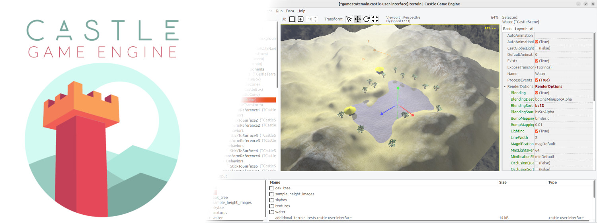
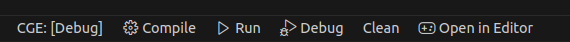
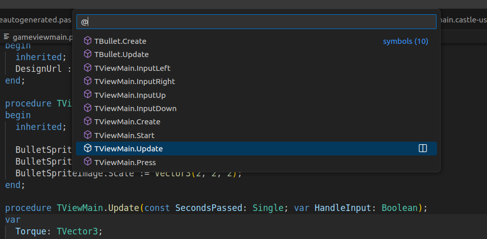

# Castle Game Engine VS Code extension

This extension provides support for [Castle Game Engine](https://castle-engine.io/) in [Visual Studio Code](https://castle-engine.io/vscode).

[Castle Game Engine](https://castle-engine.io/) is a cross-platform (desktop, mobile, console) 3D and 2D game engine.

## Installation

First of all, [download](https://castle-engine.io/download) and [install](https://castle-engine.io/install) the engine.

Then configure the extension by setting the path to the engine (_"Engine Path"_). All the other settings should be detected automatically, though you may want to customize them in special cases. E.g. customize path to the [Free Pascal Compiler](https://www.freepascal.org/) and its sources if you use a different FPC than bundled with the engine.

## Features

We want to simplify working with _Castle Game Engine_ projects in _Visual Studio Code_ as much as possible. All of the extension features are enabled when you open a directory with a _Castle Game Engine_ project (`CastleEngineManifest.xml` file). Some of the extension features (like Pascal code completion) are available in any Pascal file, even if it's not part of a _Castle Game Engine_ project.

To check that everything works, open any example from the `examples` subdirectory of your engine installation.

We recognize Castle Game Engine (CGE) projects and provide ready commands to:

- Compile.
- Run.
- Open CGE editor.
- Switch build mode (debug / release).
- Debug. Choose `castleDebug` when asked for debugger type. We use [Free Pascal (FPC) Debugger](https://marketplace.visualstudio.com/items?itemName=CNOC.fpdebug) under the hood. We will automatically rebuild the project if something changed before running the debug session.
- There no need to write any `tasks.json` or `launch.json` files for above.
- The most common commands are available on status bar:
   

We provide Pascal code highlighting and completion:

- Pascal Language Server (`pasls`) as provided by CGE is automatically used for code completion.
   - Use _Ctrl + Space_ to complete identifiers, members (properties, methods).
   - Use _Ctrl + Shift + O_ to jump to symbol definition in current file.
   
   - Use _Ctrl + T_ to list all symbols in the project.
   - Just to identifiers (_Ctrl + Click_).
   - The extension uses a [Pascal Language Server](https://github.com/castle-engine/pascal-language-server) that adds code completion for Pascal projects. Language server executable `pasls` (or `pasls.exe` on Windows) should already be in `bin` directory of the engine.
   - The provided Pascal code completion works for any Pascal file -- whether it's part of a _Castle Game Engine_ project or not.
- [Pascal Magic](https://marketplace.visualstudio.com/items?itemName=theangryepicbanana.language-pascal) is used for syntax highlighting.

Other features:

* We watch for file system changes and recompile only when needed.

* We can searching for the word on which the cursor is positioned in the [Castle Game Engine API Reference](https://castle-engine.io/apidoc/html/index.html).

* We add keybindings consistent (to some extent) with CGE editor and typical Pascal IDEs, like Lazarus or Delphi. These are:
   * `Ctrl` + `F9` - compile game
   * `Ctrl` + `F1` - search word in [Castle Game Engine Api Reference](https://castle-engine.io/apidoc/html/index.html)
   * `Shift` + `F9` - run game
   * `Ctrl` + `F12` - go to declaration

* Additional "Engine Developer Mode" - to easily jump to engine source code using _Ctrl + T_ (will add engine symbols to project symbols).

* Works on Windows, Linux and macOS.

    macOS note: debugger on macOS is not yet functional.

## Other extensions pulled as dependencies

This extension automatically installs two other extensions:
* [Free Pascal (fpc) Debugger](https://marketplace.visualstudio.com/items?itemName=CNOC.fpdebug) - for Pascal code debugging.
* [Pascal Magic](https://marketplace.visualstudio.com/items?itemName=theangryepicbanana.language-pascal) - for high-quality Pascal highlighting.

## Requirements

Before you start configuring this extension, you should have the [engine](https://castle-engine.io) installed. Follow the [installation instructions](https://castle-engine.io/install).

## Support us

If you like this extension and Castle Game Engine itself, please [support us on Patreon](https://www.patreon.com/castleengine).

## Extension Settings

This extension contributes the following settings:

* `castleEngine.enginePath`: Path to the Castle Game Engine location. Leave blank to load from an environment variable (`CASTLE_ENGINE_PATH`).
* `castleEngine.pascalLanguageServer.PP`: Path to Free Pascal compiler (e.g. `/usr/local/bin/fpc`). Leave blank to load from an environment variable (`PP`) or use auto-detection.
* `castleEngine.pascalLanguageServer.FPCDIR`: Path to Free Pascal sources (e.g. `/usr/local/share/fpcsrc`). Leave blank to load from an environment variable (`FPCDIR`) or use auto-detection.
* `castleEngine.pascalLanguageServer.LAZARUSDIR`: Path to Lazarus sources (e.g. `/usr/local/share/lazsrc`). Leave blank to load from an environment variable (`LAZARUSDIR`) or to try use auto-detection.
* `castleEngine.pascalLanguageServer.FPCTARGET`: Target platform (`windows`, `linux`, `darwin`). Leave blank for auto-detection.
* `castleEngine.pascalLanguageServer.FPCTARGETCPU`: Target CPU (e.g. `x86_64`). Leave blank for auto-detection.
* `castleEngine.engineDeveloperMode`: Boolean (`true` or `false`). Adds engine symbols to project symbols, to easily jump to engine source code.

## Known Issues

This the first extension release so we lack some features:
* `castleDebug`/`fpDebug` doesn't work on macOS.
* The extension doesn't work in _restricted_ mode. You need to _trust_ the folder.
* The extension supports multi-root workspaces, but in rather simple way: if you have multi-root workspace, it will actually work in first folder that has `CastleEngineManifest.xml`. This is not ideal if you have multi-root workspace with multiple folders having `CastleEngineManifest.xml`. Should we let user choose? Should we act on all matching folders? See what others are doing this situation.
* Show documentation (generated by PasDoc) as a popup in VS Code.

**Enjoy!**

- [Support the development of engine and this extension](https://www.patreon.com/castleengine)
- [Ask for support](https://castle-engine.io/talk.php)
- [Report a bug](https://github.com/castle-engine/castle-engine-vscode/issues)